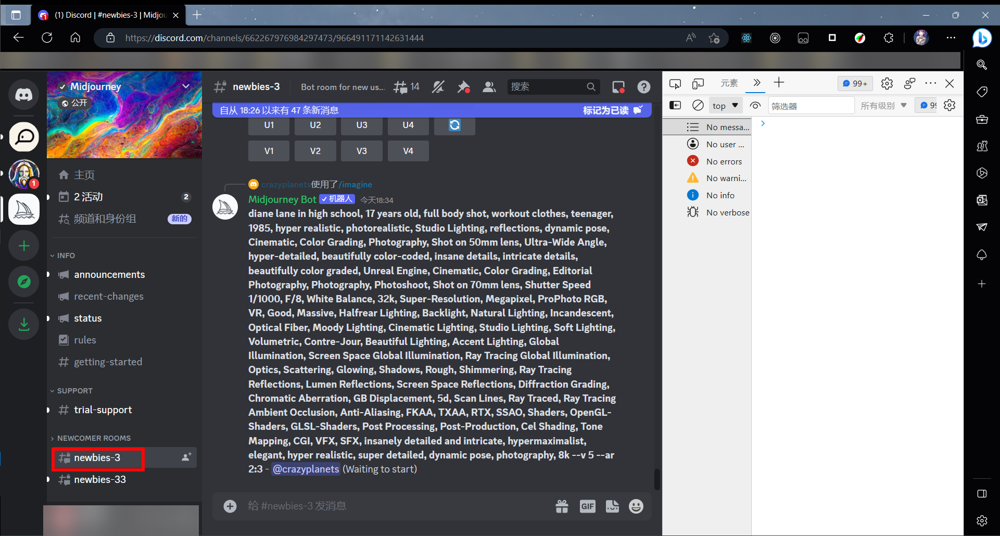
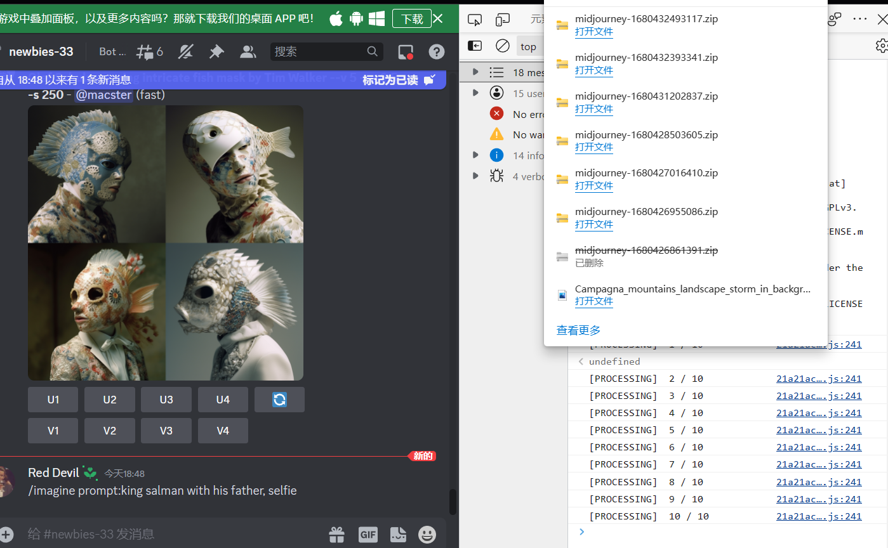

[[English]](./readme.md) [中文]

> 注意尊重版权方声明~ 仅供学习参考使用
>
# MidJourney 图片下载脚本

## 使用方式

1. 进入 Discord 聊天室，按 F12 打开控制台

2. 复制 dist/index.js 内的文件内容，粘贴到控制台并回车

3. 脚本会立刻下载一个 zip 包，之后会每满 80 张图片下载一次。你也可以输入 flushDownload()立刻下载。

4. 然后你就有很多很多漂亮图片了。

## 嘿嘿

如果你觉得好玩，你可以点个 Star，也可以去微信公众号【一只猫头猫】留言“猫头猫真棒”，我也会夸夸你~

## ⭐Support Me

| 支付宝 | 微信支付 |
| ------ | --------- |
|  |  |
