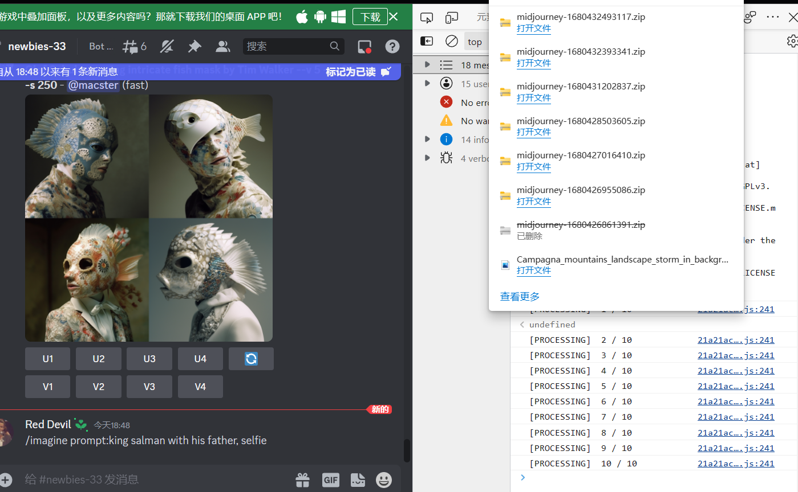
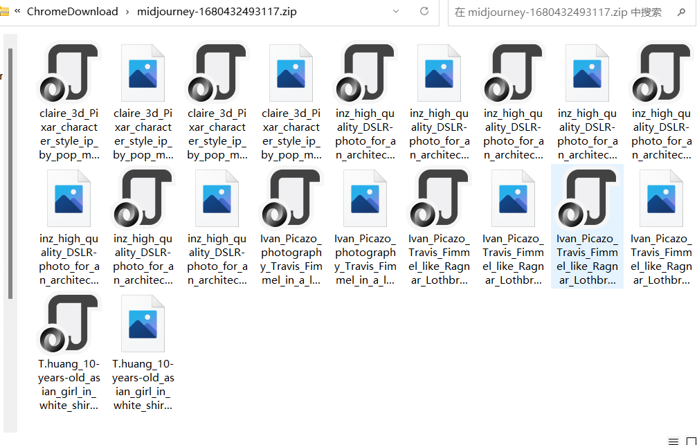

[English] [[中文]](./readme-zh.md)

> Please respect the copyright statement. This script is intended for learning and reference purposes only.

# MidJourney Images Download Script

## How to Use
1. Enter the Discord newcomer room and press F12 to open the console.

2.  Copy the contents of **dist/index.js**, paste it into the console, and press enter.

3. The script will immediately download a zip file and will download every 80 images thereafter. You can also enter *flushDownload()* to download immediately.

4. You now have many beautiful images at your disposal. Use them as your own risk.

## ⭐Support Me

| 支付宝 | 微信支付 |
| ------ | --------- |
|  |  |
